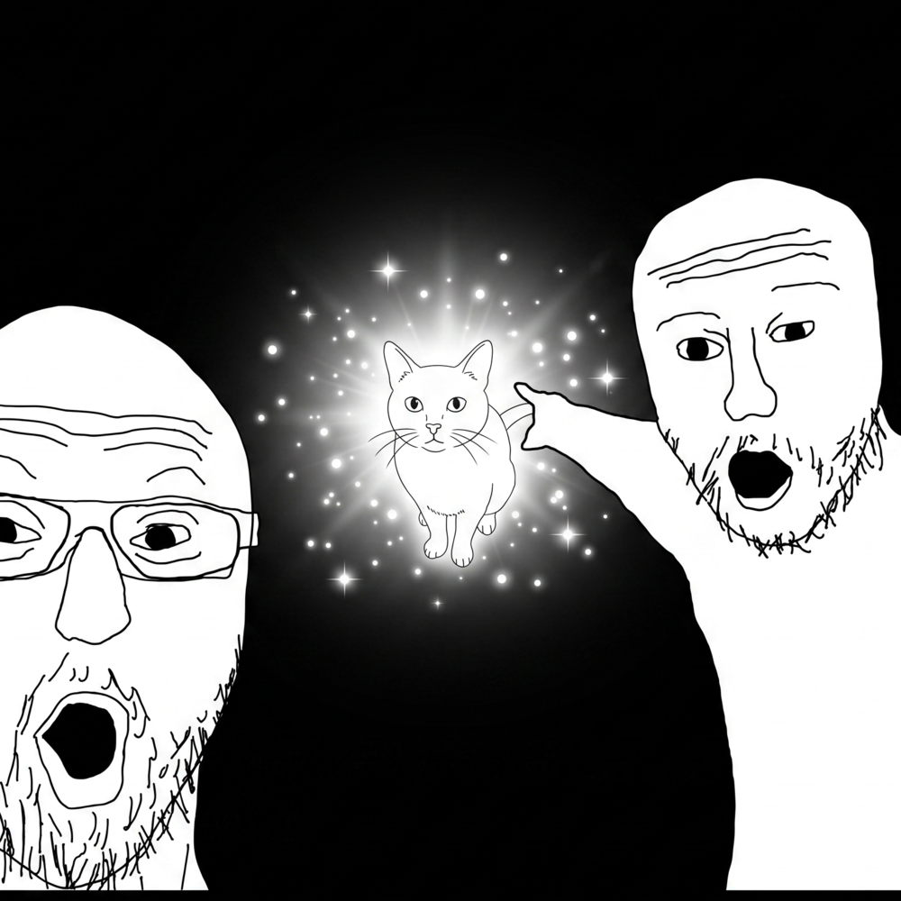

#  Un Gaaat — A Cat Collection Camera

Un Gaaat is a progressive web app that uses a local AI model to detect cats in photos taken with your camera or uploaded from your library. Every detected cat gets a score based on the rarity of its colour, and is added to your personal collection as a pixelated sticker.

> _Un Gaaat_ is Catalan for _a caaat!_ — the kind of thing you say when you spot one on the street and feel compelled to stop and pet it.

## Features

- **Cat Detection**: A quantized [YOLOS-tiny](https://huggingface.co/huggingface/yolos-tiny) ONNX model runs entirely in your browser — no image ever leaves your device.
- **Colour Rarity Scoring**: Cats are scored on a 0–10 Cat-o-meter based on the dominant colour of their fur and how rare that colour is among domestic cats. A confident Lilac can reach 10; a perfectly fine Ginger will hover around 5.
- **Pixelated Stickers**: Each capture stores a tiny pixelated thumbnail of the detected cat, displayed as chunky pixel art on the sticker card.
- **Persistent Collection**: Your cat collection is saved to localStorage and survives app restarts.
- **Export & Import**: Back up your collection as a JSON file and restore it on another device. Imports are merged by id so there are no duplicates.
- **Camera & Upload**: Capture directly from your camera or pick an existing photo from your library.
- **PWA Ready**: Install it on your home screen for a native app-like experience.

## How to Use

- **Shutter Button (Red, Center)**: Opens the camera. Tap to capture and scan.
- **Upload Button**: Opens your photo library to pick an existing image.
- **Flip Button**: Switches between front and rear cameras.
- **Export (↓) / Import (↑)**: Appear in the header once you have at least one cat. Export saves a `.json` file; import merges from a previously exported file.
- **Delete**: Tap the ✕ on any card to remove that cat from your collection.

## Scoring

The Cat-o-meter combines detection confidence with a colour rarity bonus:

| Colour | Rarity | Base Score |
|---|---|---|
| Ginger, Charcoal, Black | Common | 4.0 – 4.5 |
| Snow White, Silver, Ash Gray | Uncommon | 5.5 |
| Russet, Spotted | Uncommon | 6.0 – 6.5 |
| Golden | Rare | 7.5 |
| Slate Blue | Rare | 8.5 |
| Lilac | Very Rare | 9.5 |

Detection confidence shifts the final score by up to ±1.2 points around the base.

## Technical Notes

- Model: `Xenova/yolos-tiny`, quantized int8, run via [Transformers.js](https://github.com/xenova/transformers.js) v3
- Inference backend: WebGPU on supported desktop browsers; single-threaded WASM on iOS Safari
- Input images are resized to ≤640px before inference to keep memory within iOS Safari's limits
- Thumbnails are stored as aspect-ratio-preserving PNG data URLs at up to 32px on the longest side

## Credits

- **Model**: [YOLOS-tiny](https://huggingface.co/huggingface/yolos-tiny) via [Transformers.js](https://github.com/xenova/transformers.js)
- **Fonts**: [Inter](https://fonts.google.com/specimen/Inter)
- **Icons**: [Phosphor Icons](https://phosphoricons.com/)
